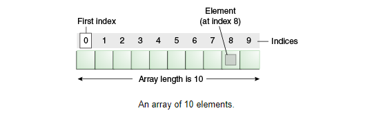
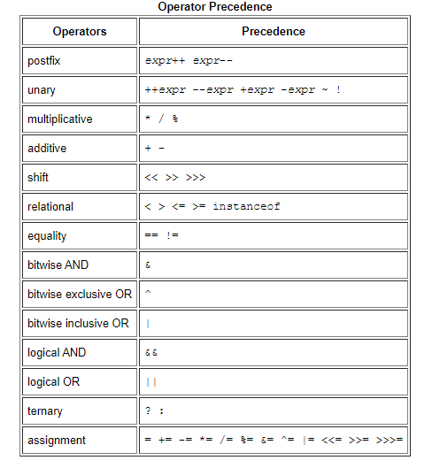
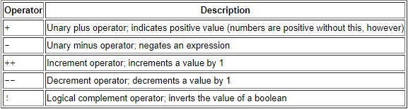

# Read: 01 - Java Basics
  
## Variables:

### Primitive Data Types

1. **byte** Default Value Is -> 	0
2. **short** Default Value Is -> 	0
3. **int** Default Value Is -> 	    0
4. **long** Default Value Is -> 	0L
5. **float** Default Value Is -> 	0.0f
6. **double** Default Value Is -> 	0.0d
7. **char** Default Value Is -> 	'\u0000'
8. **String (or any object)** Default Value Is ->   	null
9. **boolean** Default Value Is -> 	false

### Array

An array is a container object that holds a fixed number of values of a single type, and has a fixed length.



### Summary of Variables

- Instance variables (non-static fields) are unique to each instance of a class.
- Class variables (static fields) are fields declared with the static modifier; there is exactly one copy of a class variable, regardless of how many times the class has been instantiated. 
- Local variables store temporary state inside a method.
- Parameters are variables that provide extra information to a method.
- The java.lang.String class represents character strings. 

---
 
## Operators



- **Assignment Operators** ` int cadence = 0;`
- **Arithmetic Operators**  `+ - / * %`
- **The Unary Operators:** 


- **The Equality and Relational Operators** 
```
==      equal to
!=      not equal to
>       greater than
>=      greater than or equal to
<       less than
<=      less than or equal to
```
- **The Conditional Operators**
```
&& Conditional-AND
|| Conditional-OR
```
- **Bitwise and Bit Shift Operators**

---
- When you compile code, the compilor (usually another program) takes the program the human wrote, and converts it into the program the computer can understand (i.e. converts from Java to machine language). The very short version could be, yes, compile means to make the code executable.

---
