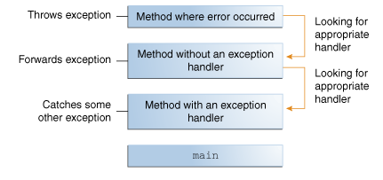

# Read: 03 - Maps, primitives, File I/O

## [Primitives vs. Objects](https://www.baeldung.com/java-primitives-vs-objects)

### Java Type System
- 1. **Primitives**-> int, boolean 
- 2. **Reference types** -> Integer, Boolean. 
- **Autoboxing:**: The process of converting a primitive type to a reference one.
- **Unboxing:** opposite process 

###  Pros and Cons

- 1. The impact of the the primitive type variables can vary depending on the Virtual Machine implementation on the memory; for example: boolean In Oracle's VM takes 32 bits instead of 1 bit.

- 2. Primitive types are faster than those for wrapper classes, and the dominant factor is:  
- The primitive types live in the stack.
- The reference types live in the heap. 

- 3. The primitive types values only from their domains,
-  The reference types might acquire a value (null) that in some sense doesn't belong to their domains.
- Because:
- Default values of the primitive types are 0 
( i.e. 0, 0.0d etc) for numeric types,
 false for the boolean type,
  \u0000 for the char type. 

- For the wrapper classes, the default value is null.


## [Exceptions in Java](https://docs.oracle.com/javase/tutorial/essential/exceptions/index.html)

### What Is an Exception?
- **Exception object** : the object that created by the method to hands the error within the method, it contains information about the error, including its type and the state of the program when the error occurred.

- **throwing an exception:** the process of creating an exception object and handing it to the runtime syste
- **The call stack:** The ordered list of methods that the system call to get to the method where the error occurred.
- **Exception handler** The block of code that can handle the exception that inside the call stack for a method. 




### The Catch or Specify Requirement

- **The code that might throw certain exceptions must be enclosed by either of the following:**

- 1. A try statement that catches the exception. 

- 2. A method that specifies that it can throw the exception.


- **The Three Kinds of Exceptions**
- 1. **The checked exception:** These are exceptional conditions that a well-written application should anticipate and recover from.

- 2. **The error:** These are exceptional conditions that are external to the application, and that the application usually cannot anticipate or recover from. 

- 3. **The runtime exception:** These are exceptional conditions that are internal to the application, and that the application usually cannot anticipate or recover from. 


## [Using Scanner to read in a file in Java)](https://docs.oracle.com/javase/tutorial/essential/io/scanning.html)


- Objects of type **Scanner** are useful for breaking down formatted input into tokens and translating individual tokens according to their data type.

- By default, a scanner uses white space to separate tokens. 

```
To use a different token separator, invoke useDelimiter(), specifying a regular expression. For example, suppose you wanted the token separator to be a comma, optionally followed by white space. You would invoke,
s.useDelimiter(",\\s*");
```

