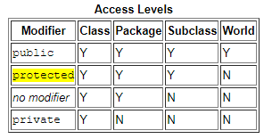
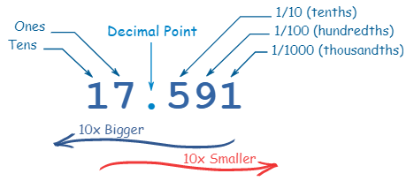

# Read: 04 - OOP

## [Java OO Tutorial](https://docs.oracle.com/javase/tutorial/java/concepts/object.html)

### What Is an Object?

- **Real-world objects share two characteristics: state and behavior.**
- Software objects are similar: they too consist of state and related behavior. 

- An object stores its state in fields (variables in some programming languages) and exposes its behavior through methods (functions in some programming languages).
- **Data Encapsulation** a fundamental principle of object-oriented programming that about Hiding internal state and requiring all interaction to be performed through an object's methods.

- **Software objectsbenefits:**
1. **Modularity:** The source code for an object can be decompose into a set of modules so that can be written and maintained independently of the source code for other objects.

2. **Information-hiding:**  the details of  object's internal implementation remain hidden from the outside world.

3. **Code re-use:** If an object already exists (in differnet program by different developer), you can use that object in your program. 

4. **Pluggability and debugging ease:** If a particular object turns out to be problematic, you can simply remove it from your application and plug in a different object as its replacement. 


## [Java Classes](https://docs.oracle.com/javase/tutorial/java/javaOO/classes.html)

### Declaring Classes
```
class MyClass {
    // field, constructor, and 
    // method declarations
}
```
- The convention to write Class Name is Capital.

- **Kinds of variables:**
1. Member variables in a class-> are called fields.
2. Variables in a method or block of code -> are called local variables.
3. Variables in method declarations -> are called parameters.

- You can use a construct called **varargs** to pass an arbitrary number of values to a method. 
To use varargs, you use  (three dots, ...), then a space, and the parameter name. 
```
public Polygon polygonFrom(Point... corners) {
    int numberOfSides = corners.length;
    double squareOfSide1, lengthOfSide1;
    squareOfSide1 = (corners[1].x - corners[0].x)
                     * (corners[1].x - corners[0].x) 
                     + (corners[1].y - corners[0].y)
                     * (corners[1].y - corners[0].y);
    lengthOfSide1 = Math.sqrt(squareOfSide1);

    // more method body code follows that creates and returns a 
    // polygon connecting the Points
}
```
1. **Pass By Value** -> when you pass Primitive arguments, such as an int or a double.
2. **Pass By Reference** -> when you pass Reference data type parameters, such as objects, as this example:
```
public void moveCircle(Circle circle, int deltaX, int deltaY) {
    // code to move origin of circle to x+deltaX, y+deltaY
    circle.setX(circle.getX() + deltaX);
    circle.setY(circle.getY() + deltaY);
        
    // code to assign a new reference to circle
    circle = new Circle(0, 0);
}
```

- **Using the this Keyword** -> this is a reference to the current object.

- **Controlling Access to Members of a Class:**



- To create an object from a class -> use the **new** operator and a constructor. 
- The **new** operator returns a reference to the object that was created. 


## [Binary, Decimal and Hexadecimal Numbers](https://www.mathsisfun.com/binary-decimal-hexadecimal.html)



- **The Decimal Number System OR Base 10**, because it is based on the number 10, with these 10 symbols (from 0-9).

- **Binary Numbers OR Base 2** (0&1).

- **Hexadecimal Numbers** 16Symbols from 0-F