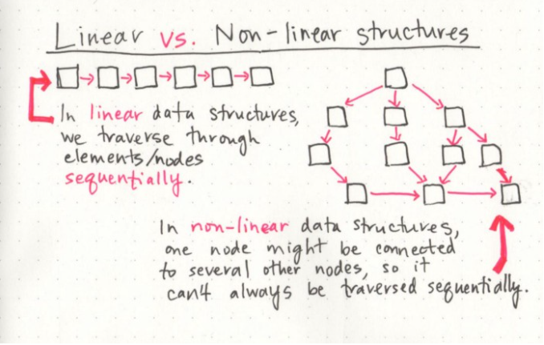
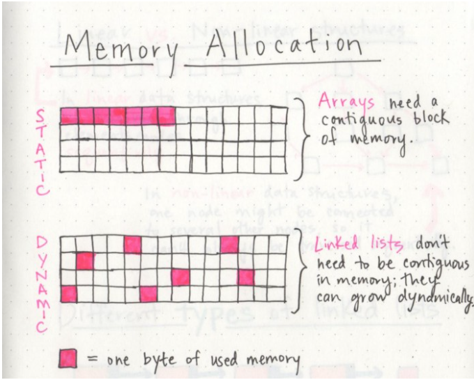
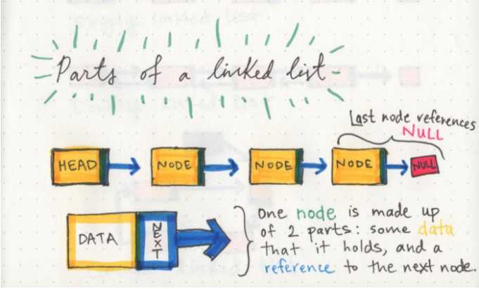
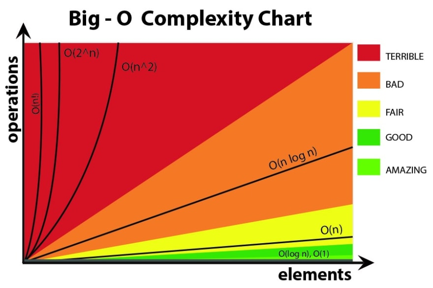
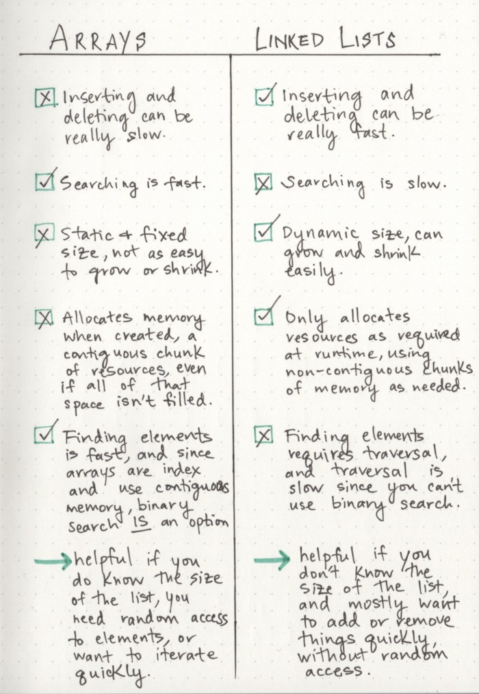

# Read: Linked Lists

## [Linked Lists](https://codefellows.github.io/common_curriculum/data_structures_and_algorithms/Code_401/class-05/resources/singly_linked_list.html)

- **A Linked List**  A data structure that contains nodes that links to the next node in the list.
-  **Linked List types** are - Singly and Doubly. 
- **Singly linked list** allows traversal elements only in one way.
- **Doubly linked list** allows element two way traversal.
- **Node properties are:** Next / Head/ Current.
- 

## [What’s a Linked List,PT1](https://medium.com/basecs/whats-a-linked-list-anyway-part-1-d8b7e6508b9d)
  

- In **Circular linked list**  all nodes are connected as a circle, so, There is no NULL at the end.

## [What’s a Linked List,PT2](https://medium.com/basecs/whats-a-linked-list-anyway-part-2-131d96f71996)

- **There are two major points to consider when thinking about how an algorithm performs:** how much time it requires at runtime given how much time and memory it needs.

- **Big O notation** is a way to express the amount of time that a function, action, or algorithm takes to run based on how many elements we pass to that function.

  

