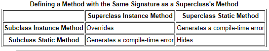

# Read: 06 - Inheritance and Interfaces

## [Java OO](https://docs.oracle.com/javase/tutorial/java/concepts/)

- An object stores its state in fields, which are defined in classes.
- Real-world objects contain state and behavior.
- A software object's state is stored in fields.
- A software object's behavior is exposed through methods.
- **encapsulation** is about to Hide internal data from the outside world, and accessing it only through publicly exposed methods.
- **class** is a blueprint for a software object.

### What Is Inheritance?

- OOP allows classes to inherit commonly used state and behavior from other classes.
- In the Java programming language, each class is allowed to have one direct superclass, and each superclass has the potential for an unlimited number of subclasses:


- The extends keyword, Used to inherit common behavior from superclass into a subclass:
`class MountainBike extends Bicycle {}`

### What Is an Interface?

- An interface is abstract class, that is a group of related methods with empty bodies(with no implementation). 

- If your class claims to implement an interface, all methods defined by that interface must appear in its source code before the class will successfully compile.

### What Is a Package?
- A package is a namespace that organizes a set of related classes and interfaces by functionality. 

- The Java platform provides an enormous class library (a set of packages) suitable for use in your own applications. This library is known as the **Application Programming Interface(API)**. Its packages represent the tasks most commonly associated with general-purpose programming. 

- The Java Platform API Specification contains the complete listing for all packages, interfaces, classes, fields, and methods supplied by the Java SE platform.

## [Java Inheritance & Interfaces](hhttps://docs.oracle.com/javase/tutorial/java/IandI/index.html)

### Interface

- **An interface declaration consists of** modifiers, the keyword interface, the interface name, a comma-separated list of parent interfaces (if any), and the interface body.

```
public interface GroupedInterface extends Interface1, Interface2, Interface3 {

    // constant declarations
    
    // base of natural logarithms
    double E = 2.718282;
 
    // method signatures
    void doSomething (int i, double x);
    int doSomethingElse(String s);
}
```

- The public access specifier indicates that the interface can be used by any class in any package. 

- An interface can extend other interfaces, whereas a class can extend only one other class. 
- The interface declaration includes a comma-separated list of all the interfaces that it extends.

- The interface body can contain abstract methods, default methods, and static methods. - An abstract method within an interface is followed by a semicolon, but no braces (it does not contain an implementation).

- All constant values defined in an interface are implicitly public, static, and final. 

- class can implement more than one interface, so the **implements** keyword is followed by a comma-separated list of the interfaces implemented by the class.

- By convention, the implements clause follows the extends clause, if there is one.

- To compare the size of similar objects, no matter what they are, the class that instantiates them should implement Relatable.

-  For strings, it could be number of characters; for books, it could be number of pages; and so forth.

- If you know that a class implements Relatable, then you know that you can compare the size of the objects instantiated from that class.

```
public class RectanglePlus 
    implements Relatable {
    public int width = 0;
    public int height = 0;
    public Point origin;

    // four constructors
    public RectanglePlus() {
        origin = new Point(0, 0);
    }
    public RectanglePlus(Point p) {
        origin = p;
    }
    public RectanglePlus(int w, int h) {
        origin = new Point(0, 0);
        width = w;
        height = h;
    }
    public RectanglePlus(Point p, int w, int h) {
        origin = p;
        width = w;
        height = h;
    }

    // a method for moving the rectangle
    public void move(int x, int y) {
        origin.x = x;
        origin.y = y;
    }

    // a method for computing
    // the area of the rectangle
    public int getArea() {
        return width * height;
    }
    
    // a method required to implement
    // the Relatable interface
    public int isLargerThan(Relatable other) {
        RectanglePlus otherRect 
            = (RectanglePlus)other;
        if (this.getArea() < otherRect.getArea())
            return -1;
        else if (this.getArea() > otherRect.getArea())
            return 1;
        else
            return 0;               
    }
}
```

- When you extend an interface that contains a default method, you can do the following:


### Inheritance

-  Classes can have fields whereas interfaces cannot. 
- One reason why the Java programming language does not permit you to extend more than one class is to avoid the issues of multiple inheritance of state, which is the ability to inherit fields from multiple classes.

- The Java programming language supports **multiple inheritance** of type (The ability of a class to implement more than one interface).

- An object can have multiple types: the type of its own class and the types of all the interfaces that the class implements. 


- **An instance method** is a method that belongs to instances of a class, not to the class itself.
- Overriding is a feature that allows a subclass to provide a specific implementation of a method that is already provided by one of its super-classes or parent classes.

- The overriding method has the same name, number and type of parameters, and return type as the method that it overrides. A


- If a subclass defines a static method with the same signature as a static method in the superclass, then the method in the subclass hides the one in the superclass.

- Instance methods are preferred over interface default methods.



`Note: In a subclass, you can overload the methods inherited from the superclass. Such overloaded methods neither hide nor override the superclass instance methods—they are new methods, unique to the subclass.`

### Polymorphism
`The dictionary definition of polymorphism refers to a principle in biology in which an organism or species can have many different forms or stages.`

  


So, as in photo, it refers to the ability of an object to take on many forms.  

### Super


