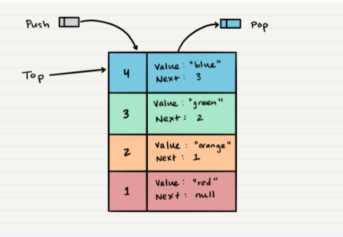

#  [Stacks & Queues](https://codefellows.github.io/common_curriculum/data_structures_and_algorithms/Code_401/class-10/resources/stacks_and_queues.html)

## What is a Stack
`A stack is a data structure that consists of Nodes. Each Node references the next Node in the stack, but does not reference its previous.`

### Common terminology for a stack is

- Push
- Pop -  When you attempt to pop an empty stack an exception will be raised.
- Top - The top of the stack.
- Peek - Is to view the value of the top Node in the stack. an exception will be raised if the stack is empty.
- IsEmpty - returns true OR false if the stack isEmpty or not.

### Stacks follow these concepts:

1. **FILO (First In Last Out)** -> The first item pushed into the stack, The last item popped out of the stack. 
- ex: As in text editor
2. 1. **LIFO (Last In First Out)** -> The last item pushed into the stack, The first item popped out of the stack.
- ex: as ctrl+Z

  

- **Push O(1)** Pushing a Node onto a stack will always be an O(1) operation. 

```
ALOGORITHM push(value)
// INPUT <-- value to add, wrapped in Node internally
// OUTPUT <-- none
   node = new Node(value)
   node.next <-- Top
   top <-- Node
```

- **Pop O(1)**
```
ALGORITHM pop()
// INPUT <-- No input
// OUTPUT <-- value of top Node in stack
// EXCEPTION if stack is empty

   Node temp <-- top
   top <-- top.next
   temp.next <-- null
   return temp.value
```

- **Peek O(1)**

First, Is to check isEmpty before conducting a peek. to ensure that an exception is not raised. 

```
ALGORITHM peek()
// INPUT <-- none
// OUTPUT <-- value of top Node in stack
// EXCEPTION if stack is empty

   return top.value

```
- **IsEmpty O(1)**
```
ALGORITHM isEmpty()
// INPUT <-- none
// OUTPUT <-- boolean

return top = NULL
```

## What is a Queue

### Common terminology for a queue is

- Enqueue - To Add Node/Item.
- Dequeue - To remove Node/Item. an exception will be raised if the queue is empty.
- Front - This is the front/first Node of the queue.
- Rear - This is the rear/last Node of the queue.
- Peek 
- IsEmpty 

### Queues follow these concepts:

1. **FIFO (First In First Out)** -> The first item in the queue, The first item out.
2. **LILO (Last In Last Out)** -> The last item in the queue, The last item out.

- we use it with mails and caching.
  

- **Enqueue O(1)**

```
ALGORITHM enqueue(value)
// INPUT <-- value to add to queue (will be wrapped in Node internally)
// OUTPUT <-- none
   node = new Node(value)
   rear.next <-- node
   rear <-- node
```

- **Dequeue O(1)**

```
ALGORITHM dequeue()
// INPUT <-- none
// OUTPUT <-- value of the removed Node
// EXCEPTION if queue is empty

   Node temp <-- front
   front <-- front.next
   temp.next <-- null

   return temp.value
```

- **Peek O(1)**
Same as in the stack

- **IsEmpty O(1)**

- additional:
### [Types of Queue](https://www.baeldung.com/cs/types-of-queues):
1. **Circular Queue** - > the last node(**front**) points to the first node(**rear**) and creates a circular connection,  Thus, it allows us to insert an item at the first node of the queue when the last node is full and the first node is free.

It’s also called a ring buffer:


