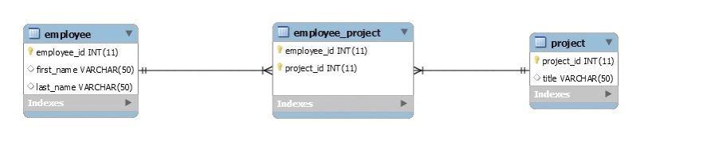

# [Many to many relationships](https://www.baeldung.com/hibernate-many-to-many)

  

As in this example emplyee_project table has 2 foriegn keys that from other tables, because many emplyees can work in many projects.

which means it happens when multiple records in a table are associated with multiple records in another table. 

# [Security: a humorous overview](https://scholar.harvard.edu/files/mickens/files/thisworldofours.pdf)

Security researchers have a problem with public relations they tells people what to do and what not without explination.

- threat models (threat/solution)-> give every threat a solution

